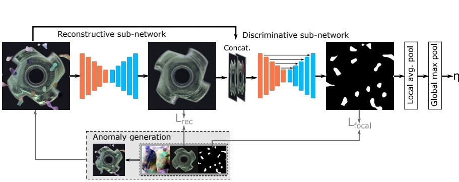

# 🔍 Discriminatively trained Reconstruction Anomaly Embedding Model

This repository contains an implementation of [DRAEM](https://arxiv.org/abs/2108.07610), based on the [GitHub repository](https://github.com/VitjanZ/DRAEM?tab=MIT-1-ov-file).



## 📦 Installation
To set up the required dependencies, simply run:

```bash
pip install -r requirements.txt
```

## 🚀 Training & Evaluation

⚠️ Before any of the things described below be sure to have download the [DTD dataset](https://www.robots.ox.ac.uk/~vgg/data/dtd/) and placed it in a folder named  `dtd`.

The entire training and evaluation process is managed within **main.py**, offering four key functionalities:

### 🏋️ Train the Network
```bash
python main.py --train True
```

### 📊 Compute Optimal Thresholds
```bash
python main.py --threshold True
```

### 🧐 Evaluate & Test the Model
```bash
python main.py --detection True
```

🔹 **Configuration:** All hyperparameters, dataset paths and other useful parameters must be defined in the `config.yaml` file. Helpful comments are included for most parameters to guide you through its structure.

🔹 **Note:** This project also uses cutout to boost performance, however it can be removed by modifying the `cut` parameter in the .yaml file, as it is not used in the original paper.

## 📝 Special Scripts
Beyond the main training and evaluation process, additional scripts were created to streamline experimentation:

- **train_all.py** 📈 - Automates training across all dataset categories, updating the `.yaml` file and saving results automatically. A `training_times.txt` file logs the training duration.
- **evaluate_checkpoints.py** 📊 - Evaluates trained models across different techniques (masking, image registration, etc.), storing evaluation metrics, graphs, and curves. ⚠️ Be mindful of storage space!
- **check_best_model.py** 🏆 - Analyzes logs to determine the best-performing model based on evaluation metrics and creates a summary report.

🔹 **Important:** These scripts rely on predefined parameters at the start of each file, update them as needed to suit your setup. 

🔹 **Important:** The order of execution matters, as each step depends on the previous one's outputs.
## 📂 Dataset Structure
This project was tested on a **custom dataset** (not included in this repository). However, it can be used with benchmark datasets like [MVTec AD](https://www.mvtec.com/company/research/datasets/mvtec-ad/) or any dataset structured as follows:

```bash
Name_of_Dataset
|-- Category
|-----|----- ground_truth
|-----|----- test
|-----|--------|------ good
|-----|--------|------ ... (other anomalous categories)
|-----|----- train
|-----|--------|------ good
```
The **train** set should contain only **nominal samples** (`good`), while the **test** set should include both nominal and anomalous samples.

## 📖 Citation
If you use this work, please cite the following paper:

```bibtex
@InProceedings{Zavrtanik_2021_ICCV,
    author    = {Zavrtanik, Vitjan and Kristan, Matej and Skocaj, Danijel},
    title     = {DRAEM - A Discriminatively Trained Reconstruction Embedding for Surface Anomaly Detection},
    booktitle = {Proceedings of the IEEE/CVF International Conference on Computer Vision (ICCV)},
    month     = {October},
    year      = {2021},
    pages     = {8330-8339}
}
```
